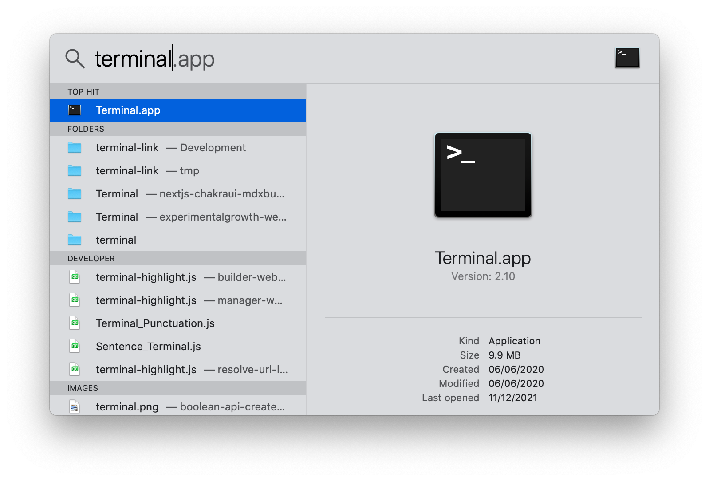
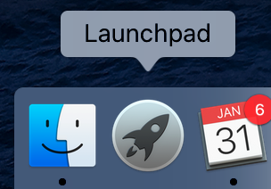

# macOS Setup Instructions

There are 6 steps in this guide:

1. Setup of Terminal.App
2. Install git
3. Install Homebrew
4. Install Visual Studio Code

   4.1 Install extensions

5. Install NodeJS
6. Setup SSH Keys for GitHub

   6.1 Add SSH Keys to GitHub

   6.2 Check SSH & GitHub Setup

## 1. Setting up Terminal.app

The Terminal is a program that developers use to run commands that tell the operating system (or another program), to perform specific tasks.

With the Terminal program we can install softwares that can be run from the terminal that perform really useful tasks for developers (such as creating an empty starter project, to running our project and so on).

On macOS we can launch the terminal in the following ways.

**Option 1:** from spotlight search.

- Press `CMD+Space` on your keyboard
- In the search bar, type "Terminal"
- Press enter or click on the Terminal application



_Note_ - in your Spotligh Search, `Terminal.app` might just be called `Terminal` without the `.app` at the end. It corresponds to the same program.

**Option 2:** from Launchpad

- Open Launchpad
- In the search bar, type "Terminal"
- Click to open the terminal app



**Launch & add to Launchbar**

1. Launch the Terminal application using one of the options above
2. In the Launcher toolbar, right-click on the Terminal App -> Options -> Keep in Dock
3. You can now launch the Terminal by clicking in the launcher toolbar


## 2. Install git (Command Line Tools)

`git` is a program that allows developers to create snapshots of their code (backups) so that it is very easy to go back to a previous version in case we make some big mistakes in our code, or collaborate with other developers, when we end up writing code in the same files.

On macOS, `git` is installed with the `Command Line Tools` package for `XCode`, which is a required tool to install Homebrew (step 3.)

1. Launch the terminal app
2. Type this command and press enter

   `xcode-select --install`

   If you have Command Line Tools already installed, the above command will return an error. You can jump to step 7.

3. If you don't have the tools already installed, a popup will appear. Choose the option `Install`.
4. Wait for the package to download and install.
5. Quit the terminal completely
6. Open the terminal again
7. Check that git is installed by typing the following command

   `git --version`

   The above should produce something similar to:

   ```bash
   > git --version
   git version 2.24.3 (Apple Git-128)
   ```

## 3. Install Homebrew

[Homebew homepage](https://brew.sh/)

Homebrew is a program that runs in the terminal that developers use to install other programs/software and libraries that we want to use for creating or running our own programs.

Homebrew simplifies installing dependencies.

Homebrew has the following [installation requirements](https://docs.brew.sh/Installation):

- macOS 10.15+ (older versions work)
- A 64-bit Intel CPU or Apple Silicon CPU
- Command Line Tools (CLT) for Xcode (from xcode-select --install or https://developer.apple.com/download/all/)

1. Launch the Terminal app
2. Paste the following command in the terminal (`CMD+V` or right-click -> paste)

```bash
/bin/bash -c "$(curl -fsSL https://raw.githubusercontent.com/Homebrew/install/HEAD/install.sh)"
```

3. Press enter and wait for the command to complete the installation
4. Type the following command in the terminal and press enter. This will update homebrew

   `brew update`

5. You're good to go!

## 4. Install VSCode

> Note: we recommend installing VSCode using `brew` because `brew` takes care of several additional setup steps that are time consuming to do manually (for example, being able to open VSCode from the terminal).

[Visual Studio Code](https://code.visualstudio.com) is a code editor. It allows us to manage the files in a project and to edit the code that we write. It comes with a large number of very useful features that make development faster and easier. We can also improve its functionality by installing many extensions.

1. Open Terminal app
2. Make sure you have updated `brew` with

   `brew update`

3. Run the following command that will take care of installing VSCode for you

   `brew install --cask visual-studio-code`

4. Launch the application by running `code` as a command in the terminal
5. Pin the application to your launchbar, the same way as we did for the Terminal app so that you have quick access to it.

### 4.1. Install additional VSCode Extensions

Now follow the instructions for setting up the extensions for VS Code.

[Setup VSCode Extensions](vscode-setup-instructions.md)

## 5. Install NodeJS

[NodeJS](https://nodejs.org/en/) is a runtime environment for JavaScript. It allows us to build and run javascript applications. We shall make extensive use of this throughout the course.

We are following the instructions [from this guide](https://www.taniarascia.com/setting-up-a-brand-new-mac-for-development/#nodejs) to install NodeJS on our machine. The summary of the instructions is below.

> **DO NOT** install Node via the NodeJS website. If you are are getting an error in your terminal following the steps in this guide use the support channel and ask for help

1. Install NVM

   `curl -o- https://raw.githubusercontent.com/nvm-sh/nvm/v0.39.1/install.sh . bash`

   If you get an error that `curl` is not installed, you can run `brew install curl`

2. Install the latest version of NodeJS

   `nvm install --lts`

3. Restart terminal and run the final command.

   `nvm use --lts`

4. Confirm that you are using the latest version of Node and npm. Version 16 is the latest stable. If you installed version 17 for Node, that is also OK. `npm` should be version 8+.

   `node -v && npm -v`

Further reading on nvm: [https://github.com/nvm-sh/nvm](https://github.com/nvm-sh/nvm)

## 6. Setup SSH Keys for Github

An SSH key is an access credential for the SSH (secure shell) network protocol. This authenticated and encrypted secure network protocol is used for remote communication between machines on an unsecured open network. SSH is used for remote file transfer, network management, and remote operating system access.

We will need SSH Keys in order to push our code to GitHub.

> GitHub have a [detailed guide for you to follow](https://docs.github.com/en/authentication/connecting-to-github-with-ssh/generating-a-new-ssh-key-and-adding-it-to-the-ssh-agent), although we have summarised some of the key steps here.

1. Open Terminal app
2. Run the following command (will create a hidden folder called `.ssh`, if it doesn't exist already)

   `mkdir .ssh`

3. Run the following command to move into the newly created directory

   `cd .ssh`

   Make sure you are in the `.ssh` folder. Run the command `pwd` and you should expect to see this output:

   `/Users/YOUR_USERNAME/.ssh`

4. Now we run the following command to generate a new SSH key and save it to our machine. Make sure you replace *your_email@example.com* with your email - this is just a name for the key and it allows you to recognise it.

   `ssh-keygen -t rsa -b 4096 -C "your_email@example.com"`

   Once you press enter, you will be asked to choose a filename (you can go for `githubkeys`) and then a password. Make sure to note this down safely.

   Once you have followed the instructions, you should see an output similar to this:

   

5. Now we need to update the configuration for SSH so that it knows to use the newly created key when you attempt to authenticate with github. Make sure you are in

   Make sure you are in the `.ssh` folder. Run the command `pwd` in your Terminal and you should expect to see this output:

   `/Users/YOUR_USERNAME/.ssh`

   Now we try to create an empty `config` file, if it doesn't exist already by running:

   `touch config`

   Now run the command `code ./config` which will open the empty (or existing) `config` file directly in Visual Studio Code.

   You now want to add the following configuration at the bottom of your `config` file and save:

   ```
   Host github.com
     AddKeysToAgent yes
     UseKeychain yes
     IdentityFile ~/.ssh/githubkeys
   ```

   **NOTE:** you will have to replace `~/.ssh/githubkeys` with the key filename that you chose in step 4.

### 6.1. Adding SSH Keys onto Github account

Once you have generated SSH Keys on your machine, we need to add the public key to our github account so that github can authenticate your machine and allow you to push code to github.

1. Open the Terminal app
2. Open the public SSH key file that you created earlier by running

   `code ~/.ssh/YOUR_GITHUB_SSH_KEY.pub`

   Replace `YOUR_GITUBH_SSH_KEY` with the filename of the SSH key that you generated earlier.

   The file should look something like:

   ```
   ssh-rsa AAAAB3NzaC1yc2EAAAADAQABAAACAQDHFR60xwGFKN5DHVaMKy7t6mwV0qFDHtLUkxQlUoMCN5Pmn3VXkiUminNDDVtYdDT0BQ70UTPXi6Q6GbinaYNvlOjKDeHnZoMltLcyqSK9EFjZVaUj8zXgX8dARgU+tROjNA6gj3gsO59zO5vqhrJZxWLtYisU3vuuUx2eKwwwIekzMMfoU6lej5l7VIKZ6l6cpxNnPvNKdPB8/cZHJqgVkXoJf+yx7Na5oC/LjEL3Ud4kRnKuEY5PkDYfKYsVQXcja+lgIKPswK5FwFXE5GyAXhlJOBW0EVkatqwXOD6XT6kcUnNsgmezUNbvvhJgV5oez4Y59jPVUWhwgO+eKrT6mKNthVWDddACClVpnN1iMSTgo+W5nfIL2yUOEZ+IvS5RvyUxLe5R4n5sHQDx1FF1oq8UXTquVmQyp1nmagPze7S7qezYsiTSDXTjZxlurhDeva0rLJZ8jD4fL/By4Hldp4zj4YEdw4VORzaQTNXHFL/QDcQfXzPUoDfFB3TUvEG4vqrkfjypkIWpzxCfjFBJqRwLqc+ri9Xtvv4mOBd9M0D1pSbToj6ubvbw1nrTgSyNQ5m9PPQa2ppWrps0N7y2fAjLVScjXUj897OJZehb9V0yM03UosRUNRjdiEA8usOqR+NInISXYH97jw+hILuewaSOb443aKfuDHAu48O1Bw== your_email@example.com
   ```

3. Select _all_ the text with `CMD+A` and copy it to clipboard with `CMD+C`
4. Visit your [Github settings](https://github.com/settings/profile) page (requires login, then find your profile icon and the dropdown next to it will take you to the Settings page).
5. From your Github Settings page, you will find the SSH and GPG Keys section in the left sidebar (alternatively, visit [https://github.com/settings/keys](https://github.com/settings/keys))
6. Click the green `New SSH Key` button.
7. Choose a title and paste the key you copied earlier with `CMD+V` (see the screenshot below)

   

   **NOTE**: make sure that when you paste, you are not pasting whitespace (new lines, spaces).

8. Click `Add SSH Key`

### 6.2 Check that SSH & Github are setup correctly

In your terminal, run the following command:

`ssh -T git@github.com`

If everything is correctly setup, you should see the following message:

`Hi YOUR_GITHUB_USERNAME! You've successfully authenticated, but GitHub does not provide shell access.`
