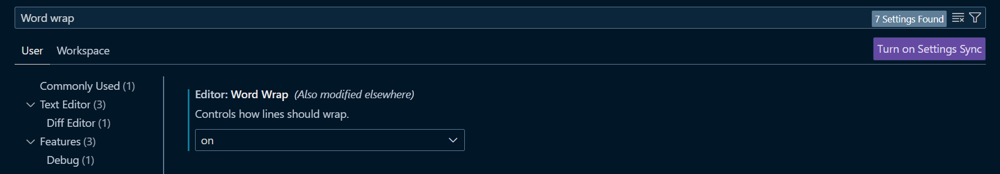
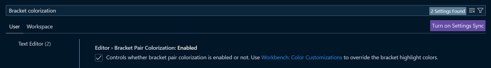
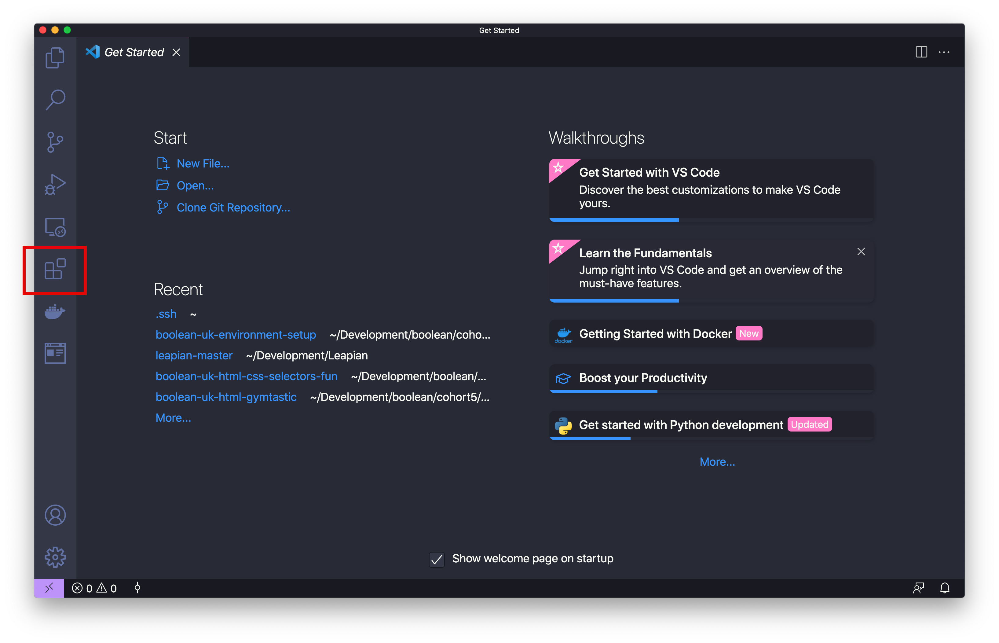
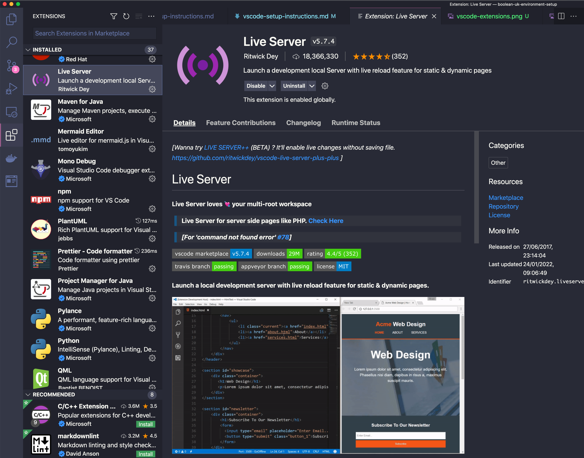
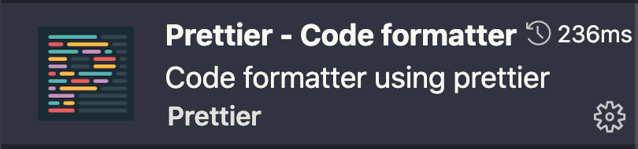
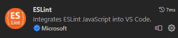
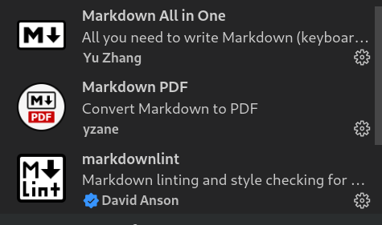

# Change Visual Studio Code Settings

There are many settings that can be tweaked and changed to fulfil different purposes and preferences, from font size to themes you can explore, but there are two settings that you will find beneficial:

- [ ] Wrap text - to ensure all characters in all files don't go off the screen to the right, making it easier to read
      

- [ ] Bracket colorization - to colour paired brackets to make it easier to visualise scope
      

# Install Visual Studio Code Extensions

> Visual Studio Code can be extended with new functionality by installing Extensions.

We will install a few Extensions that will be very useful to us in the coming weeks.

- [ ] Launch VSCode (you should see something like the following welcome screen, minus a few sidebar icons).

  

- [ ] Click the Packages icon in the sidebar, to access the Extension setup page for VSCode. This is the icon in the red box above.
- [ ] In the searchbar, you can find a desired extension.

  > Each extension comes with a description page which usually includes instructions on how to configure or use that extension. You can click the `install` button against each extension that you wish to add to your VSCode. Below is an example of the `Live Server` extension page.

  

## Add Extensions

Please add the following extensions to your VSCode:

1. Prettier

   

2. ESLint

   

3. HTMLHint

   

4. Live Server

   

5. Markdown Extensions

   Markdown All in One, Markdown PDF and markdownlint

   

6. REST Client

   

7. TODO Highlight

   
