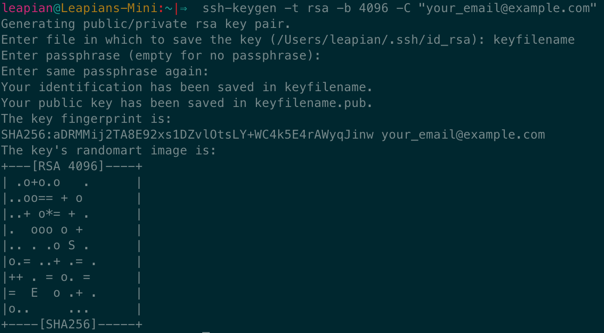
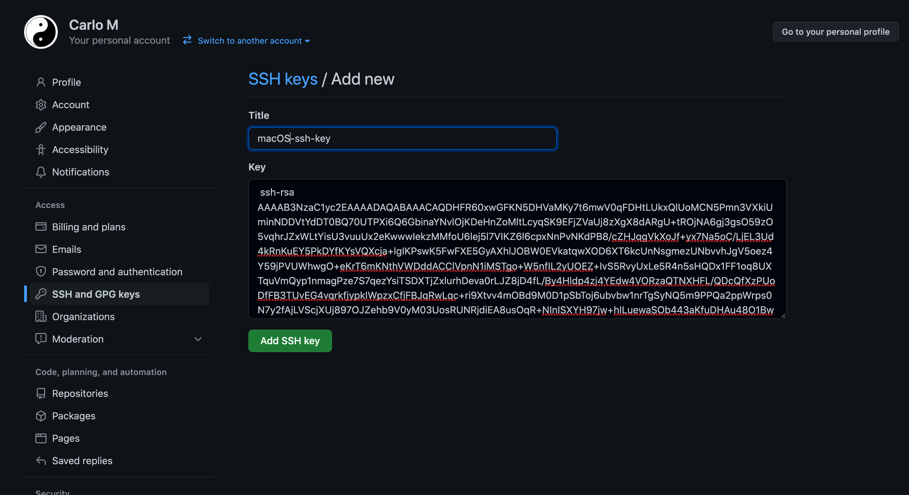

# Windows Setup Instructions

There are 5 steps in this guide:

1. Install git & Git Bash
2. Install Visual Studio Code

   3.1 Install VSCode Extensions

3. Install NodeJS
4. Setup SSH Keys for GitHub

   4.1 Add SSH Keys to GitHub
   4.2 Check SSH & GitHub Setup

## 1. Install git & Git Bash

`git` is a program that allows developers to create snapshots of their code (backups) so that it is very easy to go back to a previous version in case we make some big mistakes in our code, or collaborate with other developers, when we end up writing code in the same files.

1. Browse to the [Git Download for Windows page](https://git-scm.com/download/win) and select the `Standalone Installer (64-bit Git)` download - unless you have a `32-bit version of Windows`.
2. Once the download is complete, run it from your browser's download bar.

   1. **Select defaults for all options during the installation**.

   2. When the installation is complete, press the `<Windows>` key and type `git` into the search to find the `git bash` app

      

   3. Right click on the `git bash` app and click `Pin this program to the taskbar` so you can start it quickly.

      

   4. Click the `git bash` icon in the Taskbar to run it
      1. Type the following text in the `git bash` window and then `<Enter>`
      2. Type `exit` then `<Enter>` to close this window
   5. Now click the `git bash` icon in the Taskbar to run it again
      1. This time you should see some messages like `missing setup message related to .bash_profile`
      2. `git bash` is now set up and ready for the next steps
   6. Exit the `git bash` window by typing `exit` and then `<Enter>`
   7. Open a new `git bash` window by clicking on it's icon in the Windows Taskbar

      1. At the `$` prompt in the new window, type `git --version` and then `<Enter>` to check `git` is correctly installed. You should see something like the following text displayed:

      ```text
      git version 2.35.1.windows.1

      user@PC-NAME MINGW ~
      $
      ```

      2. Finally type `exit` and then `<Enter>` to close the window.

## 2. Install VSCode

[Visual Studio Code](https://code.visualstudio.com) is a code editor. It allows us to manage the files in a project and to edit the code that we write. It comes with a large number of very useful features that make development faster and easier. We can also improve its functionality by installing many extensions.

1. Visit [VSCode's download page](https://code.visualstudio.com/download) and select the `User Installer 64 bit` download - unless you have a `32 bit version of Windows`.
2. Once the download is complete, run it from your browser's download bar.
3. Launch VSCode and make sure to pin the software to the Taskbar for future access.

### 2.1 Install VSCode Extensions

Now follow the instructions for setting up the extensions for VS Code.

[Setup VSCode Extensions](vscode-setup-instructions.md)

## 4. Install NVM

[NodeJS](https://nodejs.org/en/) is a runtime environment for JavaScript. It allows us to build and run javascript applications. We shall make extensive use of this throughout the course.

We will use a tool called `nvm` to install NodeJS - [Link to GitHub Repository](https://github.com/nvm-sh/nvm)

1. Open a new `git bash` window by clicking it's icon in the Windows Taskbar - set up in step 1 above.
2. Paste the following command into the `git bash` window

   ```text
   curl -o- https://raw.githubusercontent.com/nvm-sh/nvm/v0.39.1/install.sh | bash

   ```

3. Install the latest version of NodeJS

   `nvm install node`

4. Restart terminal and run the final command.

   `nvm use node`

5. Confirm that you are using the latest version of Node and npm.

   `node -v && npm -v`

Further reading on nvm: [https://github.com/nvm-sh/nvm](https://github.com/nvm-sh/nvm)

## 4. Setup SSH Keys for Github

An SSH key is an access credential for the SSH (secure shell) network protocol. This authenticated and encrypted secure network protocol is used for remote communication between machines on an unsecured open network. SSH is used for remote file transfer, network management, and remote operating system access.

We will need SSH Keys in order to push our code to GitHub.

> GitHub have a [detailed guide for you to follow](https://docs.github.com/en/authentication/connecting-to-github-with-ssh/generating-a-new-ssh-key-and-adding-it-to-the-ssh-agent), although we have summarised some of the key steps here.

1. Click the `git bash` icon in the Taskbar to run it
2. Run the following command (will create a hidden folder called `.ssh`, if it doesn't exist already)

   `mkdir .ssh`

3. Run the following command to move into the newly created directory

   `cd .ssh`

   Make sure you are in the `.ssh` folder. Run the command `pwd` and you should expect to see this output:

   `/c/Users/<YOUR_USERNAME>/.ssh`

4. Now we run the following command to generate a new SSH key and save it to our machine. Make sure you replace *your_email@example.com* with your email - this is just a name for the key and it allows you to recognise it.

   `ssh-keygen -t rsa -b 4096 -C "your_email@example.com"`

   Once you press enter, you will be asked to choose a filename (you can go for `githubkeys`) and then a password. Make sure to note this down safely.

   Once you have followed the instructions, you should see an output similar to this:

   

5. Now we need to update the configuration for SSH so that it knows to use the newly created key when you attempt to authenticate with github. Make sure you are in

   Make sure you are in the `.ssh` folder. Run the command `pwd` in your Terminal and you should expect to see this output:

   `/Users/YOUR_USERNAME/.ssh`

   Now we try to create an empty `config` file, if it doesn't exist already by running:

   `touch config`

   Now run the command `code ./config` which will open the empty (or existing) `config` file directly in Visual Studio Code.

   You now want to add the following configuration at the bottom of your `config` file and save:

   ```
   Host github.com
     HostName github.com
     PreferredAuthentications publickey
     IdentityFile ~/.ssh/githubkeys
   ```

   **NOTE:** you will have to replace `~/.ssh/githubkeys` with the key filename that you chose in step 4.

### 4.1. Adding SSH Keys onto Github account

Once you have generated SSH Keys on your machine, we need to add the public key to our github account so that github can authenticate your machine and allow you to push code to github.

1. Click on the `git bash` icon in the Taskbar to run it.
2. Open the public SSH key file that you created earlier by running

   `code ~/.ssh/YOUR_GITHUB_SSH_KEY.pub`

   Replace `YOUR_GITUBH_SSH_KEY` with the filename of the SSH key that you generated earlier.

   The file should look something like:

   ```
   ssh-rsa AAAAB3NzaC1yc2EAAAADAQABAAACAQDHFR60xwGFKN5DHVaMKy7t6mwV0qFDHtLUkxQlUoMCN5Pmn3VXkiUminNDDVtYdDT0BQ70UTPXi6Q6GbinaYNvlOjKDeHnZoMltLcyqSK9EFjZVaUj8zXgX8dARgU+tROjNA6gj3gsO59zO5vqhrJZxWLtYisU3vuuUx2eKwwwIekzMMfoU6lej5l7VIKZ6l6cpxNnPvNKdPB8/cZHJqgVkXoJf+yx7Na5oC/LjEL3Ud4kRnKuEY5PkDYfKYsVQXcja+lgIKPswK5FwFXE5GyAXhlJOBW0EVkatqwXOD6XT6kcUnNsgmezUNbvvhJgV5oez4Y59jPVUWhwgO+eKrT6mKNthVWDddACClVpnN1iMSTgo+W5nfIL2yUOEZ+IvS5RvyUxLe5R4n5sHQDx1FF1oq8UXTquVmQyp1nmagPze7S7qezYsiTSDXTjZxlurhDeva0rLJZ8jD4fL/By4Hldp4zj4YEdw4VORzaQTNXHFL/QDcQfXzPUoDfFB3TUvEG4vqrkfjypkIWpzxCfjFBJqRwLqc+ri9Xtvv4mOBd9M0D1pSbToj6ubvbw1nrTgSyNQ5m9PPQa2ppWrps0N7y2fAjLVScjXUj897OJZehb9V0yM03UosRUNRjdiEA8usOqR+NInISXYH97jw+hILuewaSOb443aKfuDHAu48O1Bw== your_email@example.com
   ```

3. Select _all_ the text with `<Ctrl-A>` and copy it to clipboard with `<Ctrl-C>`
4. Visit your [Github settings](https://github.com/settings/profile) page (requires login, then find your profile icon and the dropdown next to it will take you to the Settings page).
5. From your Github Settings page, you will find the SSH and GPG Keys section in the left sidebar (alternatively, visit [https://github.com/settings/keys](https://github.com/settings/keys))
6. Click the green `New SSH Key` button.
7. Choose a title and paste the key you copied earlier with `<Ctrl-C>` (see the screenshot below)

   

8. Click `Add SSH Key`

### 4.2 Check that SSH & Github are setup correctly

In your terminal, run the following command:

`ssh -T git@github.com`

If everything is correctly setup, you should see the following message:

`Hi <YOUR_GITHUB_USERNAME>! You've successfully authenticated, but GitHub does not provide shell access.`
