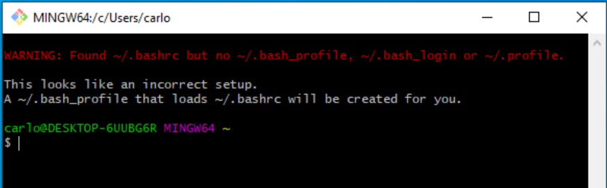

# Install git and Git Bash
---
> `git` is a program that allows developers to create snapshots of their code (backups) so that it is very easy to go back to a previous version in case we make some big mistakes in our code, or collaborate with other developers, when we end up writing code in the same files.

## Git Download
- [ ] Browse to the [Git Download for Windows page](https://git-scm.com/download/win) and select the `Standalone Installer (64-bit Git)` download - unless you have a `32-bit version of Windows`.

- [ ] Once the download is complete, run it from your browser's download bar.

### Git Install
This section will guide you on how to install git on your computer and 
   - [ ] **Select defaults for all options during the installation**.

   - [ ] When the installation is complete, press the `<Windows>` key and type `git` into the search box to find the `git bash` app

      

   - [ ] Right click on the `git bash` app and click `Pin to taskbar` so you can start it quickly from the Taskbar.

      

   - [ ] Click the `git bash` icon in the Taskbar to run it

---
## Open git Bash

   - [ ] Type the following text in the `git bash` window and then `<Enter>`

      ```bash
      touch .bashrc
      ```

      >If you get **an error stating** that you don't have permissions to create the file, then it is likely `git bash` did not launch from the correct folder. Make sure you followed steps 2 and 3 above, if not seek support.

   - [ ] Type `exit` then `<Enter>` to close this window

   - [ ] Now click the `git bash` icon in the Taskbar to run it again

      1. This time you should see some messages like `missing setup message related to .bash_profile`

         

      2. The warning message tells us `git bash` is now set up properly and we are ready for the next steps.

   - [ ] Exit the `git bash` window by typing `exit` and then `<Enter>`.
   - [ ] Open a new `git bash` window by clicking on it's icon in the Windows Taskbar. This time, you should not see the warning above.

      1. At the `$` prompt in the new window, type `git --version` and then `<Enter>` to check `git` is correctly installed. You should see something like the following text displayed:

         ```text
         git version 2.35.1.windows.1

         user@PC-NAME MINGW ~
         $
         ```
         >If you get a message saying git not found you probably did not complete the git installations step above

      2. Finally type `exit` and then `<Enter>` to close the window.
---
| Previous | Next |
| ----- | ---------- |
| - | [Step 2 Install VSCode](windows-setup-instructions-vscode-install) |
